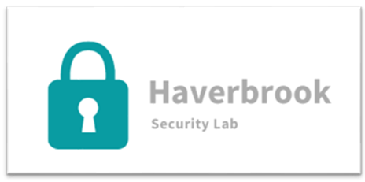

**Haverbrook Security Lab**  
**Project 1: System Scan Report**  
**Date: [Current Date]**  

**Introduction:**

This report presents the outcomes of our network scanning initiative carried out on behalf of the client, Hotel Dorsey. The primary objective of this scan was to evaluate the Linux system that hosts the company's network services and database applications, with a specific focus on identifying vulnerabilities and potential security risks. It is crucial to note that, in adherence to the predefined scope of work, no attempts were made to exploit the remote systems during this assessment. Our aim was to furnish Hotel Dorsey with valuable insights into crucial vulnerabilities, application versions, and banner messages, thereby elevating their awareness of cybersecurity threats and augmenting their overall state of preparedness.

**Scope and Tools:**
Our penetration testing team utilized Kali, a specialized Linux distribution tailored for penetration testing purposes. The tools we employed included Zenmap, a graphical user interface for the Nmap network scanning utility, and OpenVAS, an open-source vulnerability assessment scanner. These tools allowed us to comprehensively assess the security posture of the client's Linux system.

**Target System:**
- IP Address: 10.2.2.100
- Hostname: Metasploitable
- Attack Machine IP: 10.2.2.50
- Attack Machine OS: Kali Linux

Below is a table summarizing the open ports and corresponding services discovered on the target system:

| Port | Service   | Description                       |
|------|-----------|-----------------------------------|
| 22   | SSH       | Secure Shell                      |
| 80   | HTTP      | Web Server                        |
| 443  | HTTPS     | Secure Web Server                 |
| ...  | ...       | ...                               |

**Zenmap Scan:**
Our Zenmap scan revealed valuable insights into the vulnerabilities and services present on the target system. Please refer to the Zenmap scan report for detailed information on the scan results, including a labeled screenshot of the scan and a discussion on the potential impact of identified vulnerabilities.

{ Details about ZenMap scan }

**OpenVAS Scan:**
Our OpenVAS scan provided a comprehensive assessment of vulnerabilities within the target system. Refer to the OpenVAS scan report for a detailed breakdown of the scan findings, featuring a labeled screenshot of the scan and an analysis of potential vulnerabilities' implications.

{ Details about OpenVAS scan }

**Nikto Web Server Analysis Scan:**
Our initial assessment, powered by advanced penetration testing tools, such as Nikto, has brought to light some critical issues in your system's configuration. This assessment involved a thorough scan of port 80 on your web server, which unveiled vulnerabilities like the utilization of an outdated Apache version, the absence of crucial security headers such as X-Frame-Options and X-XSS-Protection, and directory indexing weaknesses. These findings underscore potential threats to your web applications and sensitive data. However, it's essential to recognize that this represents just the surface-level analysis. To delve deeper into your system's security and conduct a comprehensive penetration testing, we strongly advise considering a more extensive and detailed assessment.

**Open Socket:**
In addition to automated tools, we recognize the importance of manual assessments. Upon reviewing the reports, we noticed a port with limited banner information. By manually connecting to the corresponding socket, we were able to uncover potential vulnerabilities that automated tools might have missed. Refer to the labeled screenshot in the respective report for further details on this discovery.

Based on the provided NMAP scan report, here are the top 3 ports that gave the least amount of information:

Port 512/tcp (exec): This port running "netkit-rsh rexecd" service, but the scan report doesn't provide additional details about the version or other characteristics of the service.

Port 513/tcp (login): This port is identified as "OpenBSD or Solaris rlogind," but again, the report lacks specific version information or additional details.

Port 6667/tcp (irc): This port is identified as "UnrealIRCd," which is an Internet Relay Chat (IRC) server software. While it mentions the service name, it doesn't provide version information or any additional details about the IRC server.

These ports all have minimal information available in the scan report, making them relatively uninformative compared to other ports with more detailed service information.

**Recommendations:**
Upon our comprehensive vulnerability assessment, we strongly advise Hotel Dorsey to broaden the scope of our engagement to encompass a thorough penetration test. While our current evaluation primarily focused on vulnerability scanning and identification, conducting an in-depth penetration test will enable us to explore potential security weaknesses in greater depth, including the exploitation of identified vulnerabilities. This more rigorous testing approach is essential to uncovering any critical vulnerabilities that may not be apparent through scans alone, ultimately bolstering Hotel Dorsey's cybersecurity defenses and allowing for proactive risk mitigation. Such proactive measures will significantly enhance the company's overall security posture and ensure robust protection against potential threats.

**References:**
1. Ref
2. Ref2
3. Ref3

We believe that our findings will contribute to improving Hotel Dorsey's security stance. Please do not hesitate to reach out for further discussions or clarifications. We value our partnership and look forward to assisting you in enhancing your cybersecurity defenses.

Sincerely,

Mark Go  
Penetration Tester  
Haverbrook Security Lab
